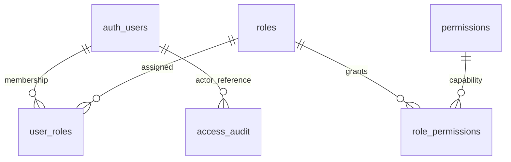

# RBAC extension to Slice 3

## Authorized design

Dynamic role membership and permission assignments live in PostgreSQL. Supabase
Auth remains the identity provider; no account/email/UUID is hard-coded as admin.
The permission catalogue is code-supported (`documents.read`, `documents.ingest`,
`roles.manage`, `users.assign_roles`), while roles, descriptions, permission sets and
user memberships can be configured in `/admin/access`. Creating a new permission
name alone cannot implement a new application capability.

`user_roles.user_id` is a real UUID FK to Supabase-owned auth.users, defined in SQL
rather than a Prisma model of the externally maintained auth schema. ON DELETE
RESTRICT requires removing memberships before deleting an Auth user. Audit actor
and target UUIDs deliberately have no destructive FK cascade: logs survive role/user
cleanup, and the target may be a role or user depending on action.

## Authorization boundary

Browser requests use their Supabase session and guarded PostgreSQL RPCs. Database
functions take no actor argument: `auth.uid()` comes from the signed session supplied
by PostgREST. Roles in editable user metadata are ignored. `getUser()` verifies each
server operation, and `my_permissions()` reads current memberships without caching.
No JWT custom-claim migration or service-role key is required.

RLS provides authenticated read access to role/permission catalogues; memberships
are readable only by their owner or users with users.assign_roles. Audit is visible
to either management permission. No authenticated user has direct write grants,
including managers. Mutation RPCs enforce permissions, validate inputs, write audit
and mutate data in one transaction. SECURITY DEFINER functions use a fixed empty
search_path and fully-qualified table names; PUBLIC/anon execution is revoked.
Internal helpers and bootstrap are owner-only, including revocation from service_role.

## Escalation and last-administrator safeguards

All RBAC writes acquire the same transaction advisory lock. Operators may only
assign/revoke roles or edit permission sets within their own effective permission
set. Direct self-membership changes are refused. Shared-role editing can only grant
rights already held by the actor. Unknown permission keys cannot be introduced via
UI/RPC. The system refuses a change leaving zero confirmed, undeleted, unbanned users
holding BOTH roles.manage and users.assign_roles, even if obtained across roles.
Audit entries include actor, action, target, timestamp and before/after role snapshots.
The invariant is checked after mutation and rolls the entire operation back on failure.

Direct database-owner writes and Supabase dashboard bans are trusted operator actions
outside these application guards. Do not manually change RBAC tables or ban/delete the
last manager through external tools; recover deliberately with audited migrations if
necessary. No application design can constrain a database owner absolutely.

## Bootstrap

The migration seeds three role presets and four capabilities but assigns NO users.
An operator explicitly runs `node scripts/bootstrap-admin.mjs <UUID>` using DIRECT_URL.
The selected Auth account must exist, be email-confirmed, undeleted and not banned.
The owner-only function is one-shot, serialized with the same lock and recorded in
the audit table. It refuses subsequent calls after bootstrap or when an administrator
already exists. There is no public setup/claim endpoint or first-signup promotion.

## Document intake integration

`/documents/import` is authenticated and requires documents.ingest. The browser
computes SHA-256 of a local file (max 10 MiB) with Web Crypto; the file input has no
name, so file bytes are not submitted. Preview shows selected metadata before import.
The Server Action validates the metadata, takes the actor from verified Supabase Auth,
and calls the existing ingestion service. That service takes a shared RBAC transaction
lock, sets the verified identity locally, switches to authenticated to recheck database
permission, then switches to the append-only ingestion role. Permission revocation and
this write therefore cannot race past each other. Missing permission fails closed.

The original internal-token API is unchanged. The browser never receives or uses the
operator token. Public knowledge stays public; documents.read is a catalogue capability
for future private scopes, not a change to current public reading policy.
