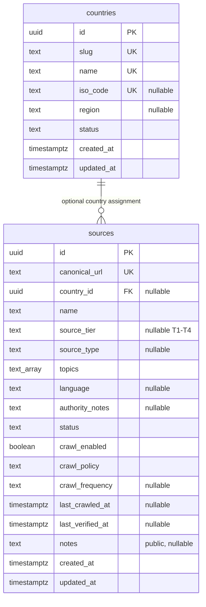

# Slice 2 implementation plan and boundaries

## Scope and sequence

1. Keep Next.js App Router, Prisma 7, Supabase PostgreSQL/Auth and existing auth.
2. Introduce countries and sources with a reproducible Prisma migration.
3. Seed only the five country names and two source URLs in PROJECT_SPEC.md.
4. Apply SELECT-only access policies for anonymous and authenticated users.
5. Add public country list/detail and source registry filters, errors and loading.
6. Test domain logic and execute SQL/RLS tests before deploying migrations.

The registry UI was initially read-only; SQL migrations were the only write path.

## Update (2026-09-19): Source Registry admin UI

Migration `20260919100000_sources_manage` (after RBAC and Facts existed, so it
follows their established pattern instead of inventing a new one) adds:

- permission `sources.manage`, granted by the migration to roles already
  holding both `roles.manage` and `users.assign_roles` (same rule as
  `facts.propose`/`facts.review` — no hard-coded user or role name);
- `save_source(...)`, a `SECURITY DEFINER` RPC that is the *only* write path
  for `countries`/`sources` — there is still no RLS write policy on `sources`,
  matching the "guarded RPCs only, every write audited" rule from the RBAC
  migration. It validates URL shape, tier/status/policy enum membership, and
  the two cross-field invariants the table's CHECK constraints already
  enforce (`verified` requires non-empty `authority_notes`; `crawl_enabled`
  requires `crawl_policy = 'approved'` and `status = 'verified'`) so the UI
  gets a clean error code instead of a raw constraint-violation message.
  `last_verified_at` is never a client-supplied value — the function stamps
  `now()` only when `status = 'verified'`, and clears it otherwise, so the
  field always means "an operator with `sources.manage` confirmed this row
  as of this timestamp", never a backdated or stale claim.
- an `access_audit` row (`action = 'source.saved'`) with the before/after
  state on every create and edit, reusing the existing audit table rather
  than inventing a parallel history mechanism.

UI: `/admin/sources` (`app/(app)/admin/sources/`), gated on `sources.manage`,
listed on `/dashboard` only when the signed-in user holds that permission.
Reuses `listSources`/`listCountries` (already public-read, so no new query
path was needed) and the same create-form-plus-one-form-per-row layout as
`/admin/access`. Registering a source through this UI still does not verify
its content — see `sources_review_check`/`sources_crawl_check` and the
verification-label copy in `lib/registry/domain.ts`.

Tests: `lib/registry/manage.test.ts` (PGlite, mirrors the RBAC/Facts SQL test
style) covers permission denial, invalid URL rejection, the verification/
crawl invariants, server-stamped `last_verified_at`, audit before/after
content, and that public reads still see new rows while direct table writes
stay denied. `lib/rbac/actions.test.ts` covers the server action: permission
check before RPC, invalid input rejected before RPC, and topic-list parsing.

Ingestion, crawler and AI are still not introduced in this slice.

## Update (2026-09-19): T1 source candidates and country-page facts

Migration `20260919110000_t1_source_candidates` adds 15 sources (3 per MVP
country: immigration/residence authority, national statistics/labour
agency, official study-in-\<country\> portal), researched via live web
search rather than guessed from a URL naming convention (AGENTS.md Section
1.2). All 15 stay `status = 'needs_verification'`, `crawl_policy =
'not_reviewed'`, `crawl_enabled = false` — an AI-compiled candidate is not
the human confirmation `status = 'verified'` or an approved crawl target
requires (AGENTS.md Section 1.3/9). 14 are tier T1 (government ministry or
agency, documented per-row in `authority_notes`); Nuffic's Study in NL
(Netherlands) is tier T2 because it is government-*funded* but an
organisationally independent non-profit, not a ministry or agency. See
`lib/registry/t1-sources.test.ts` for the PGlite check that every row lands
with these conservative defaults. This does not close the Section 18 gap —
cost-of-living/housing/healthcare sources and the remaining education
portals for DK/FI/NO/NL are still unresearched.

`/countries/[slug]` (`app/(public)/(explore)/countries/[slug]/page.tsx`) now
queries `facts` scoped to `country_id` (same Supabase-client + RLS path as
`/facts`, filtered to `status IN ('reviewed','conflicted')`) and renders
them with the existing `FactCard`, instead of always showing a static "not
available yet" block. The empty state is unchanged in spirit: with zero
reviewed facts for a country (true today — the sources above are not yet
facts), it still says so explicitly rather than inventing profile content.
See `app/(public)/(explore)/countries/country-page.test.tsx`.

## ERD

Source country is optional: a Europe-wide seed is not automatically linked to
all five countries. This follows the spec's nullable country_id design; a future
many-to-many scope requires an explicit migration if evidence requires it.
ISO/region metadata stays null because it was not supplied. Slugs are internal
route identifiers. Topics are small classification tags in a PostgreSQL text
array, not a second store of facts. Trust scoring is deferred: no methodology
exists. No numeric score or unverified facts appear in the UI.

## RLS and connection boundary

Both tables enable RLS. `anon` and `authenticated` get SELECT only with explicit
read policies; INSERT/UPDATE/DELETE are revoked and have no RLS policies. These
are public metadata tables; do not store private staff notes in their notes fields.
Future private workspace tables require owner-specific policies.

Prisma connections do not carry a Supabase user JWT. Public registry queries run
inside a transaction with literal `SET LOCAL ROLE anon`. This enforces public
policies even when the connection account owns the tables and restores the role
when the transaction ends. Never copy this helper into private-data reads without
designing the appropriate identity boundary. The connection role must be allowed
to SET ROLE anon; do not fix a failure by removing RLS or the role restriction.

Source metadata marked reviewed requires a review date and nonempty authority
notes; this does not validate downstream claims. Crawl-enabled rows must have
reviewed metadata and an approved crawl policy. The seeds satisfy neither and
remain disabled. Canonical URL uniqueness prevents identical registry entries;
this is not document content deduplication, which belongs to Slice 3/9.

## Future crawler contract (design only)

Input: registered source ID and its exact approved URL, policy status and cadence.
Scheduler eligibility: enabled AND approved policy AND reviewed registry metadata.
The worker must separately check robots.txt, allowed domain/path, content type and
size, conservative rate/concurrency, redirects/DNS safety and incremental headers.
Output: source ID, requested/canonical URL, retrieval timestamp, HTTP status,
ETag/Last-Modified, content hash and structured operation/error category. No crawler
runs from a UI visit. Approved metadata is not permission to ignore robots or terms.

## Environment and rollout

`.env.example` documents existing public auth variables plus DATABASE_URL and
DIRECT_URL. DATABASE_URL is the server runtime PostgreSQL connection; DIRECT_URL
is the direct/session migration connection. Prisma config reads `.env.local` then
`.env` without overriding CI environment. No credentials enter client modules.

Before deployment, confirm the target project/environment and migration status.
Run `npx prisma migrate deploy` then `npx prisma generate` (from `packages/db/`
since the monorepo restructure ahead of Slice 9, or `npm run db:migrate:deploy`
/ `npm run db:generate` from the repo root). No reset or db push is
needed. If tables already exist without Prisma history, inspect/baseline deliberately;
never overwrite them. Verify public SELECT and denied writes on deployed Supabase.

## Update 2026-09-23 — verification date semantics

Migration `20260923091000_source_reverification` replaces `save_source` (the old
14-argument signature is dropped; a 15th argument `p_reverify boolean DEFAULT false`
is added). `last_verified_at` is still only ever `now()` from the database, but it
is now stamped only when a row becomes `verified` or the operator ticks
"re-verified today". Other edits keep the previous date, and leaving `verified`
keeps the historical date (the status says it is no longer verified). Changing
`canonical_url` or `source_tier` of a verified row raises
`sources_reverify_required` unless re-verified. The audit entry records
`reverified` and the resulting `last_verified_at`. The text above is unchanged.
