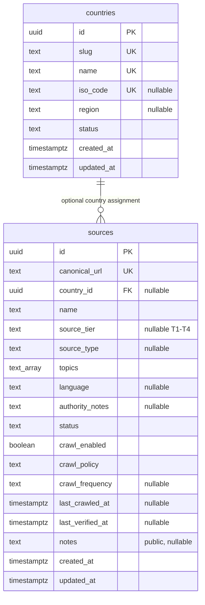

# Slice 2 implementation plan and boundaries

## Scope and sequence

1. Keep Next.js App Router, Prisma 7, Supabase PostgreSQL/Auth and existing auth.
2. Introduce countries and sources with a reproducible Prisma migration.
3. Seed only the five country names and two source URLs in PROJECT_SPEC.md.
4. Apply SELECT-only access policies for anonymous and authenticated users.
5. Add public country list/detail and source registry filters, errors and loading.
6. Test domain logic and execute SQL/RLS tests before deploying migrations.

The registry UI is read-only. No admin role or ownership convention has been
specified; an editor, create/edit actions and automated verification are deferred
until a permission model is explicitly agreed. SQL migrations are currently the
controlled write path. No ingestion, crawler or AI is introduced in this slice.

## ERD

Source country is optional: a Europe-wide seed is not automatically linked to
all five countries. This follows the spec's nullable country_id design; a future
many-to-many scope requires an explicit migration if evidence requires it.
ISO/region metadata stays null because it was not supplied. Slugs are internal
route identifiers. Topics are small classification tags in a PostgreSQL text
array, not a second store of facts. Trust scoring is deferred: no methodology
exists. No numeric score or unverified facts appear in the UI.

## RLS and connection boundary

Both tables enable RLS. `anon` and `authenticated` get SELECT only with explicit
read policies; INSERT/UPDATE/DELETE are revoked and have no RLS policies. These
are public metadata tables; do not store private staff notes in their notes fields.
Future private workspace tables require owner-specific policies.

Prisma connections do not carry a Supabase user JWT. Public registry queries run
inside a transaction with literal `SET LOCAL ROLE anon`. This enforces public
policies even when the connection account owns the tables and restores the role
when the transaction ends. Never copy this helper into private-data reads without
designing the appropriate identity boundary. The connection role must be allowed
to SET ROLE anon; do not fix a failure by removing RLS or the role restriction.

Source metadata marked reviewed requires a review date and nonempty authority
notes; this does not validate downstream claims. Crawl-enabled rows must have
reviewed metadata and an approved crawl policy. The seeds satisfy neither and
remain disabled. Canonical URL uniqueness prevents identical registry entries;
this is not document content deduplication, which belongs to Slice 3/9.

## Future crawler contract (design only)

Input: registered source ID and its exact approved URL, policy status and cadence.
Scheduler eligibility: enabled AND approved policy AND reviewed registry metadata.
The worker must separately check robots.txt, allowed domain/path, content type and
size, conservative rate/concurrency, redirects/DNS safety and incremental headers.
Output: source ID, requested/canonical URL, retrieval timestamp, HTTP status,
ETag/Last-Modified, content hash and structured operation/error category. No crawler
runs from a UI visit. Approved metadata is not permission to ignore robots or terms.

## Environment and rollout

`.env.example` documents existing public auth variables plus DATABASE_URL and
DIRECT_URL. DATABASE_URL is the server runtime PostgreSQL connection; DIRECT_URL
is the direct/session migration connection. Prisma config reads `.env.local` then
`.env` without overriding CI environment. No credentials enter client modules.

Before deployment, confirm the target project/environment and migration status.
Run `npx prisma migrate deploy` then `npx prisma generate`. No reset or db push is
needed. If tables already exist without Prisma history, inspect/baseline deliberately;
never overwrite them. Verify public SELECT and denied writes on deployed Supabase.
