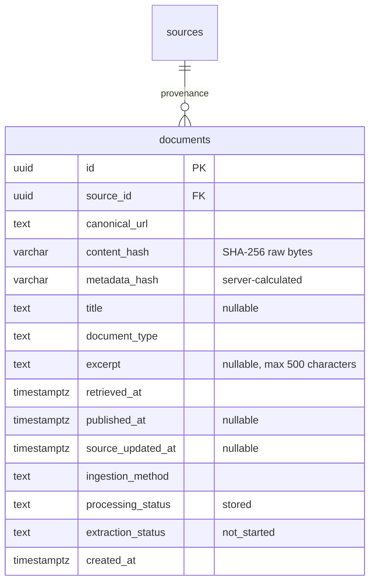

# Slice 3 — Documents and internal ingestion

## Authorized scope and implementation plan

Keep the existing Next.js/Supabase/Prisma architecture and development database.
Implement one metadata-only ingestion route, an append-only document model, public
list/detail pages, SQL/RLS tests and a local import tool. Only an operator/internal
tool holding a server secret may ingest; normal accounts remain read-only. Synthetic
fixtures stay in tests; the hosted documents table starts empty. No crawling,
full-text storage, files, AI extraction, queue or external service is introduced.

## Data relationship

Unique key: `(source_id, canonical_url, content_hash)`. URL normalization preserves
query order, path case and trailing slash, strips fragments, and rejects credentials
and non-HTTP(S) links. Changed content gets a new immutable row. The same content at
another source or URL stays separate to preserve provenance. No global hash merge.

`sha256-raw-v1` means SHA-256 of the original uncompressed response/file bytes. The
local helper computes this hash. The API cannot verify caller-supplied hashes without
full content, so these are provenance metadata, not verified evidence. `metadata_hash`
is calculated on the server from title/type/excerpt/published/updated dates in a fixed
order. Retry time and method are excluded. An identical content hash with different
metadata returns 409 and leaves the original unchanged; correction requires review.
Retried observations do not update original retrieval dates or source verification.
No ingestion input accepts status, verification dates, HTML content or full text.

## Authorization and RLS

`INGESTION_API_TOKEN` is server-only, random, >=32 characters; no default or public
fallback. The route checks it before reading the body, uses constant-time digest
comparison, caps streamed requests at 16 KiB and never trusts a Supabase session as
permission to ingest. HTTPS is required for external use. Rotate by changing the
secret in both the server environment and the operator's tool, then restarting.

A NOLOGIN/NOBYPASSRLS role `nordic_ingestor` is granted only to the migration owner.
The server's connection identity must be that owner or explicitly receive role
membership. The authorized transaction uses SET LOCAL ROLE nordic_ingestor, with
source SELECT and document SELECT/INSERT only. No UPDATE/DELETE on document history
or source policies. Public anon/authenticated roles get SELECT-only document RLS;
normal users cannot assume the internal role. Do not grant it to authenticator,
anon, authenticated or a browser-connected identity. Public read paths use the
existing anon transaction helper.

Manual ingestion requires a registered, non-blocked source and exact URL origin
match. It does not change crawl enablement. Crawler-tagged ingestion additionally
requires enabled crawling, approved crawl policy and reviewed registry metadata.
Neither mode fetches any URL or authorizes the future crawler to bypass robots,
redirect/DNS checks, rate limits, terms or access controls. The shared operator token
is trusted to label manual/crawler accurately; it is not an adversarial crawler sandbox.

## Processing and observability

Processing status `stored` means validation/deduplication/storage completed, not
that claims were analyzed. Extraction stays `not_started`. No background worker
exists yet, so no invented queue progress or processing completion is shown.
Rejected requests have no document record: structured logs show request ID, stage
(authorize/validate/store), source ID when validated, timestamp, HTTP status/category.
Successful requests log created/unchanged. Database failures return 503 without raw
connection details. Raw payloads, URLs, excerpts, headers and tokens are never logged.

The token-only internal API is not a public submission service. Body/transaction/time
limits bound per-request work; a distributed per-client quota is not included. Apply
platform rate limits before exposing this to multiple untrusted clients.
