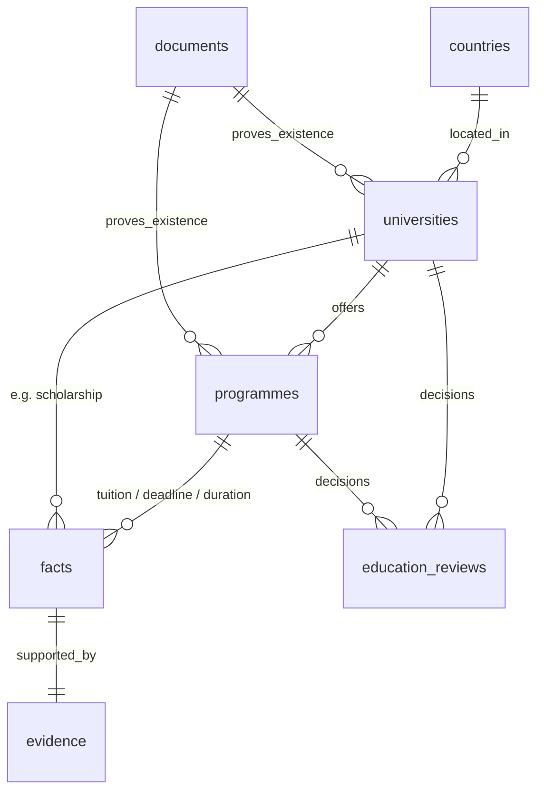

# Slice 5 — Universities and programmes (Option A)

## Decision

Chosen by the project owner on 2026-09-23 (PROJECT_SPEC.md Section 21).
Education entities store **identity only**. Tuition, application deadlines,
duration and scholarships are **facts** linked to the entity, so they reuse the
Slice 4 evidence/review/conflict/history rules. The rejected alternative (Option B)
stored tuition/deadline as columns, which would have needed a second, parallel
evidence and audit mechanism for each value.

No seed universities or programmes. No crawler, AI, new dependency or environment
variable is introduced.

## ERD

| Table | Key columns | Notes |
|---|---|---|
| universities | country_id NOT NULL, name, official_url, document_id, evidence_excerpt (≤500), status, created_by, reviewed_at | unique (country_id, lower(name)) among non-rejected rows |
| programmes | university_id, name, degree_type (bachelor/master/phd/other/unknown), field?, language?, official_url, application_url?, document_id, evidence_excerpt, status | unique (university_id, lower(name), degree_type) among non-rejected rows |
| education_reviews | university_id XOR programme_id (CHECK num_nonnulls = 1), actor_id, decision, note | append-only; real FKs instead of an entity_type/entity_id pair |
| facts (+3 columns) | university_id?, programme_id? (at most one), deadline_type? (fixed/rolling/year_round) | country inherited from the entity |

Spec Section 5 also lists `description`, `duration`, `tuition` and
`application_deadline`. `description` is omitted (free text with no evidence
rule); the other three are facts. `updated_at` is omitted because rows are
immutable proposals, the same as facts.

## Status and visibility

- `proposed` → `reviewed` | `rejected`, once. Corrections are new proposals; a
  rejected row does not block a corrected proposal with the same name.
- "Reviewed" means a reviewer checked the document and excerpt show the entity
  exists. It does NOT verify tuition, deadlines or current availability.
- A programme can only be reviewed after its university is reviewed
  (`education_university_unreviewed`). The public RLS policy on programmes also
  requires a reviewed university, so rejecting a university hides its programmes.
- Public pages add explicit `status = 'reviewed'` filters so editors, who see
  drafts through RLS, still get the public view there.

## Authorization

| Capability | Grants |
|---|---|
| education.manage (new) | `propose_university`, `propose_programme` |
| facts.review (existing) | `review_education` |
| facts.propose (existing) | attach facts to a non-rejected entity via `propose_fact` |

All writes are SECURITY DEFINER RPCs with `search_path = ''`, the shared RBAC lock
(`918202603`) and, for reviews, the same review lock as `review_fact`
(`919202604`). EXECUTE is revoked from PUBLIC/anon/service_role and granted to
authenticated only. `authenticated` has no direct INSERT/UPDATE/DELETE. Actor comes
from `auth.uid()`, never the form. The migration grants `education.manage` only to
roles already holding both `roles.manage` and `users.assign_roles`.

RLS read access:

| Table | anon | authenticated | editors (education.manage / facts.review / facts.propose) |
|---|---|---|---|
| universities | reviewed | reviewed | all |
| programmes | reviewed + reviewed university | same | all |
| education_reviews | none (no grant) | none | education.manage / facts.review |

## propose_fact changes

Dropped and recreated with three optional trailing parameters so exactly one
version exists and 10-argument callers still work. It:

- refuses both `p_university` and `p_programme` at once (`facts_invalid`);
- refuses rejected entities;
- fills `country_id` from the entity's university when omitted, and refuses a
  different explicit country (`facts_country_mismatch`) instead of choosing one;
- validates `p_deadline_type`.

## Routes

- `/programmes` — public list, filters: country, degree, field (literal
  substring, LIKE wildcards escaped), university. `next/form` gives client-side
  navigation on filter submit.
- `/programmes/[id]` — identity, existence evidence (source, tier, retrieval and
  review dates, original link), then reviewed/conflicted facts for the programme.
- `/universities` — public list with country filter and existence evidence.
- `/education/workspace` — propose (education.manage) and review (facts.review).
- `/facts/workspace` — the proposal form can link a fact to one entity and set a
  deadline type.

## Known limits

- The funding-type filter from backlog S5-02 is deferred: there is no
  evidence-backed funding/scholarship model yet.
- Lists show the latest/first 100 rows; no pagination.
- The embedded PostgREST selects use explicit FK hints
  (`programmes_university_id_fkey`, `*_document_id_fkey`). They are covered by unit
  tests with a mocked client, not yet against the hosted PostgREST. Run the
  browser check below after deploying.
- A user holding both capabilities can propose and review their own entries
  (same as Slice 4).

## Update 2026-09-23 — Slice 6a changes that touch this slice

Migration `20260923120000_immigration` replaces the CHECK
`facts_single_education_entity` with `facts_single_entity`
(`num_nonnulls(university_id, programme_id, immigration_rule_id) <= 1`) and
recreates `propose_fact` with a fourth optional trailing parameter,
`p_immigration_rule`. Education behaviour is unchanged; the 13-argument calls
above still work. See `slice-06-immigration.md`.
