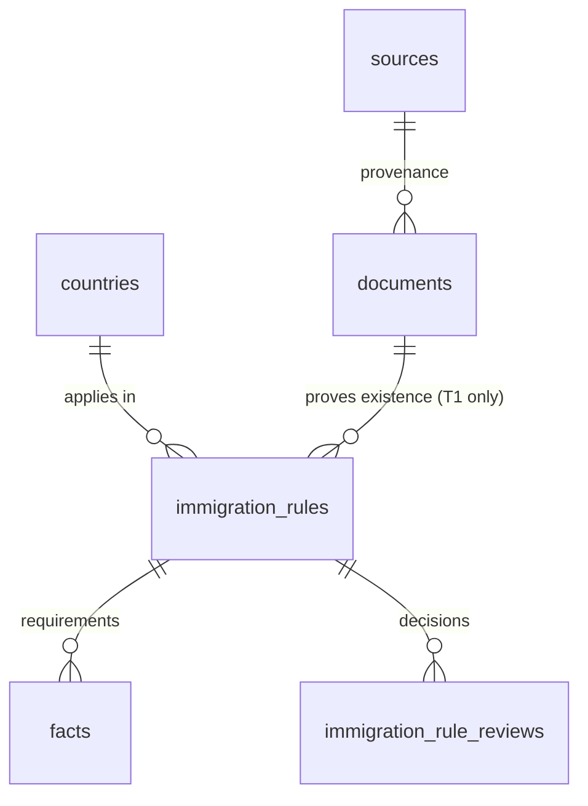

# Slice 6a — Immigration rules

Slice 6 is split: **6a immigration** (backlog S6-01, S6-02, S6-05) is built here;
**6b labour market** (S6-03, S6-04) has not been started.

## Decisions (project owner, 2026-09-23 — "follow the recommendations")

1. **Same model as Slice 5 Option A.** `immigration_rules` stores identity only:
   country, rule type, official title, official page, evidence of existence.
   Requirements (financial threshold, permit length, processing time, …) are
   facts linked via `facts.immigration_rule_id`. There is no free-text
   `summary` column (spec Section 5 suggested one); an unsourced paraphrase of
   immigration law would be exactly the uncited legal claim AGENTS.md 1.5 forbids.
2. **T1 required for the rule itself.** The evidence document must come from a
   `T1` source whose `country_id` equals the rule's country, and the rule's
   official URL must share that source's origin. Requirement facts may come from
   any tier; the UI labels non-T1 evidence "Không phải nguồn chính thức (T1)".
3. **Public only with a verified source.** A rule is public only while
   `status = 'reviewed'` AND its evidence source is still registry-`verified`
   AND still `T1`. A requirement fact is public only while its rule is public AND
   its own evidence source is `verified`. These are evaluated on every read, so
   un-verifying or downgrading a source hides the content immediately.
4. **Legal disclaimer** ("Thông tin nghiên cứu, không phải tư vấn di trú" plus an
   English line) is always rendered on `/immigration` and `/immigration/[id]`,
   together with links to the registered T1 immigration authorities.

## ERD

| Table | Key columns | Notes |
|---|---|---|
| immigration_rules | country_id, rule_type (student_residence_permit / work_permit / post_study / permanent_residence / citizenship / other), title, official_url, document_id, evidence_excerpt, status, created_by, reviewed_at | unique (country_id, rule_type, lower(title)) among non-rejected rows |
| immigration_rule_reviews | immigration_rule_id, actor_id, decision, note | append-only |
| facts (+1 column) | immigration_rule_id | `facts_single_entity`: at most one of university / programme / rule (replaces `facts_single_education_entity`) |

`valid_from` / `valid_until` from spec Section 5 live on the requirement facts
(they already have them), not on the rule identity.

## RPCs and authorization

| RPC | Permission | Checks |
|---|---|---|
| propose_immigration_rule | immigration.manage (new) | document exists; source is T1; source country = rule country; `url_origin(official_url) = url_origin(source.canonical_url)` (case-insensitive); duplicate → `immigration_duplicate` |
| review_immigration_rule | facts.review | proposed only; re-checks T1 at review time; shared review lock 919202604 |
| propose_fact (recreated, +`p_immigration_rule`) | facts.propose | at most one entity; rule not rejected; country inherited, a different country → `facts_country_mismatch` |

All are SECURITY DEFINER, `search_path=''`, EXECUTE for `authenticated` only.
No direct table writes. The migration grants `immigration.manage` only to roles
already holding both RBAC management permissions.

## RLS

- `immigration_rules_public` (anon + authenticated): reviewed + verified T1 source.
- `immigration_rules_editors`: immigration.manage / facts.review / facts.propose see all.
- `immigration_rule_reviews_editors`: immigration.manage / facts.review.
- `facts_public` is **replaced**: unchanged for facts without a rule; for facts
  with a rule it adds "rule public" and "fact's own source verified". The
  conditions are written out with joins instead of relying on nested RLS,
  because editors can see every rule and a nested check would be looser for them.
- Public pages repeat the same filters explicitly (`!inner` embeds on
  `documents.sources`) so editors see the public view there.

## Routes

- `/immigration` — disclaimer, registered T1 immigration authorities (with
  registry verification state and date), rules filtered by country / type.
- `/immigration/[id]` — disclaimer, official page, conflict banner when any
  requirement is `conflicted` (S6-05), existence evidence with retrieval /
  review / source-verification dates, requirement facts.
- `/immigration/workspace` — propose (immigration.manage) and review (facts.review).
  Shows whether each rule's source is verified, since unverified ones stay hidden.
- `/facts/workspace` — a fact can be linked to an immigration rule.

## Known limits

- Facts with topic "immigration" that are NOT linked to a rule follow the old
  (Slice 4) visibility rule. Topic is free text; link requirement facts to a rule.
- `/facts` and the country page do not repeat the verified-source filter, so a
  user with editor permissions may see non-public immigration facts there (RLS
  still hides them from everyone else).
- Nothing will appear publicly until an operator marks the relevant T1 source
  `verified` in `/admin/sources` (all 15 T1 candidates are `needs_verification`).
- Conflict resolution (US-FR-02) is still not implemented; conflicts are shown,
  not resolved.
