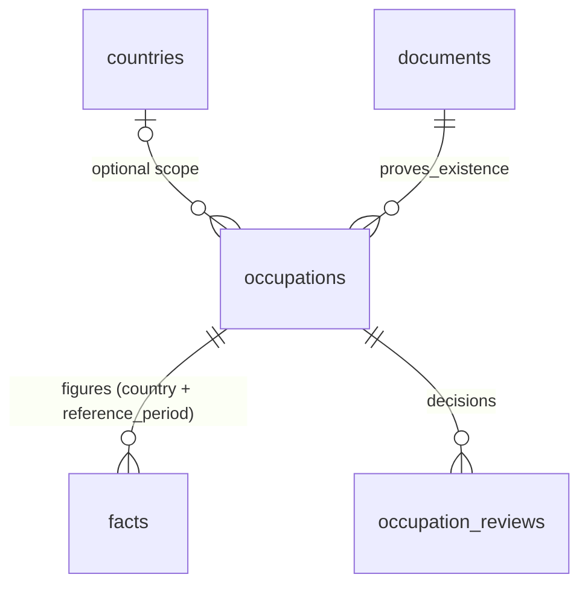

# Slice 6b — Labour market

Backlog S6-03 (migration), S6-04 (public UI per occupation). Completes Slice 6
together with 6a (immigration).

## Decisions (project owner, 2026-09-25 — "follow the recommendations")

1. **Occupations are identity only**, like universities (Slice 5 Option A):
   name, optional classification (system + code, only when the source states
   it), optional country scope, and a document + excerpt proving the entry.
   No seed rows; the spec's focus occupations (PM, PO, BA, Software
   Engineering) are entered from real sources.
2. **No `labour_market_items` table.** Spec Section 5 suggested one; each
   figure (salary, vacancies, unemployment…) is instead a **fact** linked by
   `facts.occupation_id`, reusing evidence / review / conflict / history.
   New `facts.reference_period` records which period a statistic measures
   (`YYYY`, `YYYY-Qn`, `YYYY-Hn`, `YYYY-MM`), separate from
   `valid_from`/`valid_until` (when a rule applies).
3. **Public only with a verified source.** An occupation figure is public only
   while the occupation is reviewed AND the figure's evidence source is
   registry-`verified`. Any tier may be entered; non-T1/T2 evidence is labelled
   "not official statistics" (Section 7 labour-market priority).
4. **Out of scope:** job postings, employers, skills (spec Section 15 defers job
   board aggregation).

Added integrity rule: a figure linked to an occupation must have a country
(`facts_occupation_country` CHECK, `facts_country_required` in the RPC). A
country-scoped occupation passes its country to the figure; a different
explicit country is refused (`facts_country_mismatch`).

## ERD

| Table | Key columns | Notes |
|---|---|---|
| occupations | name, classification_system? (ISCO-08/ESCO/national/other), classification_code?, country_id?, document_id, evidence_excerpt, status | system and code both set or both null; unique (lower(name), country or "international") among non-rejected |
| occupation_reviews | occupation_id, actor_id, decision, note | append-only |
| facts (+2 columns) | occupation_id, reference_period | `facts_single_entity` now covers 4 entity links |

## RPCs, authorization, RLS

| RPC | Permission |
|---|---|
| propose_occupation | labour.manage (new; granted to complete admin roles by the migration) |
| review_occupation | facts.review |
| propose_fact (recreated, + `p_occupation`, `p_reference_period`) | facts.propose |

All SECURITY DEFINER, `search_path=''`, EXECUTE for `authenticated` only, no
direct table writes. `occupations_public`: reviewed. `occupations_editors`:
labour.manage / facts.review / facts.propose. `facts_public` is replaced again:
the plain and immigration rules are unchanged; occupation-linked facts
additionally need a reviewed occupation and a verified evidence source.

## Routes

- `/occupations` — search + pagination; notice that figures describe a past
  period and are not forecasts, salary offers or advice.
- `/occupations/[id]` — classification and scope, figures filtered by a country
  segmented control (with counts), sorted by reference period, conflict banner,
  non-official label, existence evidence.
- `/labour/workspace` — propose (labour.manage), review (facts.review), status tabs.
- `/facts/workspace` — link a fact to an occupation and set a reference period.

## Known limits

- Figures from different sources/periods are shown side by side but not
  normalised (currency, gross/net, median/mean). The UI says they are not
  directly comparable; comparison belongs to Slice 7.
- Occupation facts not linked to an occupation (topic text only) follow the
  plain fact visibility rule.
- `/facts` and the country page do not repeat the verified-source filter for
  editors (same limit as 6a); RLS still hides them from everyone else.
