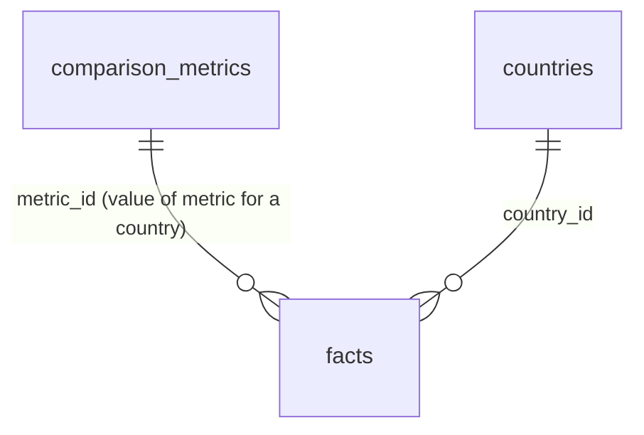

# Slice 7 — Search and country comparison

Backlog S7-01 … S7-04. Decisions confirmed by the project owner on 2026-09-26
("theo khuyến nghị"); see PROJECT_SPEC.md Section 21.

## 7a Search

- PostgreSQL full-text search only (spec Section 2.11); no Elasticsearch, no new
  extension.
- `search_fold(text)`: IMMUTABLE `lower()` + `translate()` accent folding for
  Latin/Nordic letters. `unaccent` is not installed on the project and not
  available in PGlite; a pure function behaves identically in both. Single-
  character mapping, so æ→a, ß→s are approximations.
- STORED generated `search_vector` (config `simple`) + GIN index on countries,
  sources, documents, universities, programmes, immigration_rules, occupations,
  facts. Vectors cannot drift from their rows. Changing `search_fold` requires
  re-creating these columns in a new migration.
- `search_public(q, per_type)`: SQL, **SECURITY INVOKER**, `websearch_to_tsquery`
  (safe on any input; supports quotes and `-exclude`), top N (max 20) per type
  with per-type totals. Explicit status filters repeat the public rules.
- The web app calls it with **`createPublicClient()`** (anon key, no session),
  so RLS returns exactly the public view even for signed-in editors, including
  the verified-source rules of immigration and labour figures.
- `/search` groups hits in a fixed order; header has a search button.

## 7b Comparison

- `comparison_metrics`: admin-curated **definitions only** (key, label,
  description of exactly what is measured, unit hint, category, active). No
  metric and no value is seeded. `key` and `category` are immutable after
  creation (`metrics_immutable`) so attached facts keep their meaning; other
  edits are audited in `access_audit` (`metric.saved`). Retired metrics
  (`active = false`) keep history and accept no new values.
- `facts.metric_id` (+ `facts_metric_country` CHECK: a metric value needs a
  country). `propose_fact` recreated with trailing `p_metric`.
- New permission `metrics.manage`; `/admin/metrics` to create/edit.
- `/compare?c=…&c=…` (2–5 countries, allowlisted, stable order):
  1. **Metrics table**: rows = active metrics (category segmented control),
     columns = countries. Each cell lists **every** public value with its own
     source, tier, reference period, retrieval date and a conflict badge,
     newest period first. Empty cell = "Chưa có dữ liệu".
  2. **Immigration**: rows = rule types; cells = public rules (verified T1).
  3. **Occupation**: pick an occupation → its public figures per country,
     non-T1/T2 labelled.
  4. **Education in Nordic**: counts of reviewed universities/programmes,
     labelled as counts in this system, not national totals.
- No aggregation, averaging, normalisation or score anywhere (AGENTS.md 1.4, 15).
  A test asserts no score/average/"best" text is rendered.

## Known limits

- "See all" from search opens the entity list filtered by substring (`ilike` /
  Prisma `contains`), which does not fold accents; full-text search is only on
  `/search`.
- FTS matches whole words (no prefix matching): "stock" does not find
  "Stockholm". Use the lists' substring search for prefixes.
- Values are not converted between currencies, periods or definitions.
- Comparison reads up to 1000 metric values per request; enough for 5
  countries × dozens of metrics, not unbounded.
