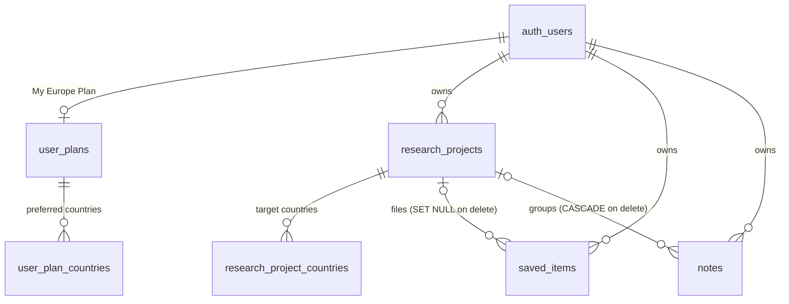

# Slice 8 — Research workspace, bookmarks, notes, My Europe Plan

Backlog S8-01 … S8-06. Decisions confirmed by the project owner on 2026-09-27
(all four recommendations); see PROJECT_SPEC.md Section 21.

First **user-private** data in the system (AGENTS.md 5.2).

## Decisions

1. **Bookmarks use real foreign keys**: `saved_items` has one FK column per
   kind (country, university, programme, immigration rule, occupation, source)
   and a CHECK that exactly one is set (AGENTS.md 4.5). One bookmark per item
   per user (partial unique indexes).
2. **One goals profile + many projects**: `user_plans` is "My Europe Plan" (one
   row per user). The spec's `personal_plans` is merged into
   `research_projects`, which carry their own target year, role and countries.
3. **Optional budget**: amount + ISO 4217 code + period, all-or-nothing CHECK,
   owner-only, never used in any calculation.
4. **Deletion**: every table cascades from `auth.users`; `delete_my_workspace()`
   lets the owner wipe everything, behind a typed confirmation in the UI.

## ERD

`notes` may also point at one item (same six FK columns, at most one set).
`user_id` defaults to `auth.uid()`; forms never send it.

## Security model

- RLS on all six tables, policy `FOR ALL TO authenticated USING (user_id =
  auth.uid()) WITH CHECK (...)`. `anon` has no grant. There is no admin read
  path and no SECURITY DEFINER function, so not even an administrator can read
  another user's workspace through the app (tested).
- WITH CHECK also requires `owns_project(project_id)` and
  `workspace_item_visible(...)`: a user can only file into their own project
  and only bookmark/annotate items the public can see (same status rules as
  the public pages; drafts are refused — tested).
- Writes go straight to tables through the user's Supabase client (owner CRUD
  is the point here); server actions validate shape only.
- `delete_my_workspace()` is SECURITY INVOKER, so RLS limits it to the
  caller's rows.

## UI

- `SaveButton` (☆ Lưu / ★ Đã lưu) on country, university, programme,
  immigration rule, occupation and source pages. Guests see "Đăng nhập để lưu".
  Initial state comes from `savedState()` (local JWT check + RLS query; a
  failure shows "not saved" and never blocks the public page).
- `/workspace`: projects (Đang làm / Đã lưu trữ), saved items (segmented by
  kind, paginated, file into project, remove, add note), recent notes, and a
  "delete all my data" section.
- `/workspace/projects/[id]`: target countries with a compare shortcut, saved
  items and notes in the project, edit / archive / delete.
- `/workspace/plan`: My Europe Plan form and **shortcuts** — plain filtered
  links built from the user's own answers, labelled "không phải khuyến nghị".
  No recommendation engine (spec Section 15 defers it).
- Notes are always labelled "Ghi chú của bạn" so they are never mistaken for
  evidence-backed facts (spec Section 14).

## Known limits

- Facts cannot be bookmarked (not in scope; facts belong to entities).
- No sharing or collaboration on projects.
- Login always returns to /dashboard (no `next` parameter, to avoid open
  redirects), so after signing in from a Save button the user navigates back.
