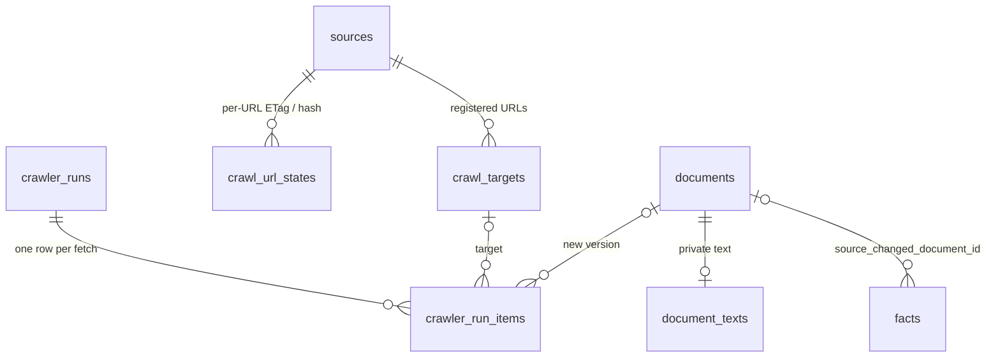

# Slice 9 — Crawler worker, incremental crawl, change detection

Decisions confirmed by the project owner on 2026-09-25 (all four
recommendations); see PROJECT_SPEC.md Section 21. Migration
`20260928090000_crawler`.

## Decisions

1. **Only registered URLs.** Admins (`crawler.manage`) register URLs per source
   in `/admin/crawler` (`crawl_targets`). A `page` target is fetched as-is; a
   `sitemap` target lists URLs filtered by same origin + optional path prefix,
   capped at `max_urls` (1–100). Sitemap indexes and in-page links are never
   followed. The source must also be `verified`, crawl policy `approved` and
   crawl enabled.
2. **Least-privilege database role, no service-role key.** The worker logs in as
   a role that is a member of `nordic_crawler_ops` (NOLOGIN, NOINHERIT, no
   table grants). It can only EXECUTE five SECURITY DEFINER functions. A
   leaked credential cannot read sources, facts, users or workspaces.
3. **Private text.** Extracted text goes to `document_texts`, readable only by
   editors (facts.propose / facts.review / documents.ingest). Public pages show
   metadata and reviewed excerpts only (AGENTS.md 8).
4. **Changed sources.** When a new version of a page is recorded, reviewed or
   conflicted facts whose evidence is an older version of the same URL get
   `source_changed_at` + `source_changed_document_id`. They stay public with a
   warning and appear in the "Nguồn đã đổi" queue until a reviewer records
   `revalidated` or `rejected` (`resolve_source_change`).

## Data model



| Table | Purpose | Who reads |
|---|---|---|
| `crawl_targets` | URL, kind page/sitemap, path prefix, max URLs, CSS selector, active | crawler.manage |
| `crawl_url_states` | last ETag, Last-Modified, hash, HTTP status, outcome, document | crawler.manage |
| `crawler_runs` | trigger schedule/manual/local, status, counts per outcome | crawler.manage |
| `crawler_run_items` | URL, HTTP status, outcome, error category, duration, flagged facts | crawler.manage |
| `document_texts` | extracted text (≤ 200 000 chars), extractor `html-text-v1` | editors |

Outcomes: `created`, `unchanged`, `not_modified`, `robots_disallowed`,
`skipped_type`, `too_large`, `error`. `documents.hash_method` now also allows
`sha256-text-v1`.

## Crawler functions (role `nordic_crawler_ops`)

| Function | What it does |
|---|---|
| `crawler_start_run(trigger)` | opens a run |
| `crawler_due_targets()` | active targets of crawlable sources |
| `crawler_url_states(source)` | ETag / Last-Modified / hash for conditional requests |
| `crawler_record(...)` | validates run, target, source state and URL; logs the item; creates a document + text only when the hash is new; flags facts |
| `crawler_finish_run(run, status, note)` | closes the run and stores counts |

`crawler_record` refuses: closed runs (`crawler_run_closed`), targets whose
source is no longer crawlable (`crawler_target_not_allowed`), URLs other than
the page target itself or outside the sitemap's origin/prefix
(`crawler_url_not_registered`).

## Worker (`crawler/`)

Node 24 + TypeScript, Crawlee `BasicCrawler` (not `CheerioCrawler`, which sends
a browser User-Agent), `cheerio` for text extraction, `pg` (pool of 1).

- robots.txt checked for `NordicResearchBot`; refusals are recorded, not retried.
- `maxConcurrency 1`, 5 s same-domain delay, 2 retries (429/5xx/network only).
- 2 MB and 30 s limits; HTML/XHTML for pages, XML for sitemaps.
- Redirects followed only within the same origin.
- `If-None-Match` / `If-Modified-Since` from the previous state.
- Text: remove script/style/nav/header/footer/…, root = selector → `main` →
  `article` → `body`, keep block line breaks, NFC + whitespace collapse, SHA-256.
- Logs one JSON line per URL; never the connection string.

## Operations

Create the login role once (Supabase SQL editor, as `postgres`). Generate the
password yourself; do **not** commit it anywhere:

```sql
CREATE ROLE nordic_crawler LOGIN PASSWORD '<generate-a-long-random-password>'
  IN ROLE nordic_crawler_ops;
```

Connection string for `CRAWLER_DATABASE_URL`: the Supabase **session pooler**
(or direct) URI with user `nordic_crawler.<project-ref>` (pooler) or
`nordic_crawler` (direct). Store it as the GitHub Actions secret
`CRAWLER_DATABASE_URL`. Optional repository variable `CRAWLER_CONTACT_URL`.

The workflow `.github/workflows/crawler.yml` runs Mondays 03:17 UTC and on
manual dispatch; without the secret it exits successfully without fetching.

Before registering a URL, preview it:

```bash
npm run probe -w @nordic/crawler -- https://example.org/page main
```

Verified on 2026-09-25: the Migrationsverket higher-education page returned
HTTP 200 and the same text hash on two consecutive probes. `migri.fi` and
`udi.no` answered 403 even for robots.txt, so they are not suitable targets
for this bot; do not try to work around that.

## Not in this slice

- AI extraction of candidate facts from `document_texts` (Slice 10).
- RSS feeds, PDF text, JavaScript-rendered pages (Playwright).
- Automatic re-verification: a reviewer always decides.
