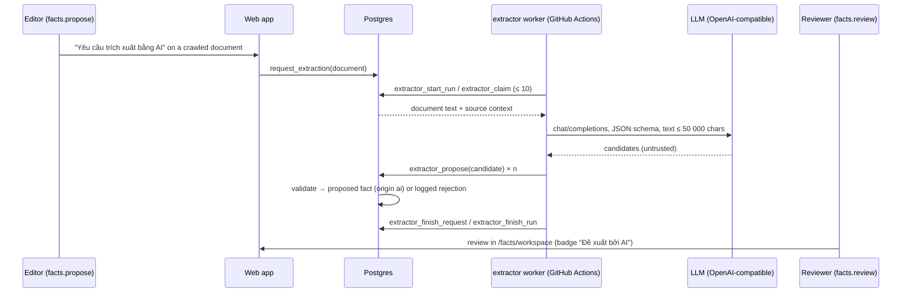

# Slice 10a — AI extraction of candidate facts

Decisions confirmed by the project owner on 2026-09-28; see PROJECT_SPEC.md
Section 21. Migration `20260929090000_ai_extraction`. Package `extractor/`.

## Flow



## Data model

| Object | Purpose |
|---|---|
| `facts.origin` (`manual`/`ai`), `ai_model`, `ai_confidence` | Attribution; confidence is the model's own estimate, never a trust score |
| `extraction_settings` | Singleton: AI account (`facts.propose`, not `facts.review`) |
| `extraction_requests` | Editor requests; one open (pending/running) per document |
| `extraction_runs` | Provider host, model, prompt version, tokens, status, counts |
| `extraction_items` | Every candidate: outcome `proposed`/`invalid`/`duplicate`/`limit`, reason, raw JSON, fact |

RLS: requests, runs and items are readable by `facts.propose` / `facts.review`;
settings also by `roles.manage`. No anonymous access. Writes only via functions.

## Functions

Editors / admins (`authenticated`): `request_extraction(document)`,
`cancel_extraction(request)`, `set_extraction_account(user)` (`roles.manage`).

Worker (`nordic_extractor_ops` only): `extractor_start_run`,
`extractor_countries`, `extractor_claim`, `extractor_propose`,
`extractor_finish_request`, `extractor_finish_run`. `extractor_start_run`
refuses to start without a suitable AI account and closes runs left open for
more than 2 hours.

## Validation (`extractor_propose`)

First failure is recorded as the reason:

1. ≤ 30 proposals per request (`limit`).
2. Topic in `extraction_topics()`: education, admission, tuition, deadline,
   scholarship, immigration, labour_market, living_cost, housing, language, other.
3. Subject/predicate 1–200, value 1–2000, unit ≤ 100 characters.
4. Excerpt 20–500 characters and **verbatim in `document_texts.text`** after
   `extraction_norm` (NFC, lower case, whitespace collapsed, digit separators
   removed).
5. Country slug exists (or empty).
6. Reference period `YYYY`, `YYYY-Qn`, `YYYY-Hn`, `YYYY-MM`; dates `YYYY-MM-DD`
   and real; `valid_until ≥ valid_from`.
7. Confidence, if given, a number 0–1.
8. **Every number** in value/unit and the year of each date/period appears in
   the excerpt as a whole number.
9. Not a duplicate of a non-rejected fact on the same document (`duplicate`).

Evidence URL and retrieval date are copied from the document, never from the
model. The worker runs the same checks locally only for `--dry-run`.

## Worker (`extractor/`)

- No SDK: one `fetch` POST to `{LLM_BASE_URL}chat/completions` with
  `response_format: json_schema`, `temperature: 0`, 120 s timeout, 3 retries on
  network/429/5xx honouring `Retry-After`, 5 s pause between documents.
- Schema fields are all required strings (empty = not stated) plus a number,
  because providers differ on nullable types.
- The page text is fenced and declared as data (prompt-injection guard).
- Logs: request id, outcome counts, tokens. Never the page text, prompt, key
  or connection string.

## Operations

1. Apply the migration.
2. Create the login role (Supabase SQL editor, as `postgres`; generate the
   password yourself and do **not** commit it):
   ```sql
   CREATE ROLE nordic_extractor LOGIN PASSWORD '<generate-a-long-random-password>'
     IN ROLE nordic_extractor_ops;
   ```
3. `/admin/extraction` → set the AI account UUID (roles.manage).
4. GitHub → Settings → Secrets and variables → Actions:
   - Secrets: `EXTRACTOR_DATABASE_URL` (session pooler URI with user
     `nordic_extractor.<project-ref>`), `LLM_API_KEY`.
   - Variables: `LLM_BASE_URL` (Gemini:
     `https://generativelanguage.googleapis.com/v1beta/openai/`), `LLM_MODEL`,
     optional `EXTRACTOR_MAX_DOCUMENTS`.
5. Open a crawled document → "Yêu cầu trích xuất bằng AI" → run the
   `extractor` workflow → review in `/facts/workspace`.

Workflow `.github/workflows/extractor.yml`: daily 04:41 UTC and manual; exits
successfully without work when any of the four settings is missing.

## Not in this slice

- Embeddings, semantic search, RAG (Slice 10b).
- AI linking to universities/programmes/rules/occupations/metrics.
- Automatic requests for every crawled version.

## Update 2026-09-28 — verified TLS to Supabase (`DATABASE_CA_CERT`)

With `?sslmode=require`, node-postgres verifies the full certificate chain and
fails with `self-signed certificate in certificate chain`, because Supabase
signs its certificates with its own root CA (chain seen on the pooler:
`*.pooler.supabase.com` ← Supabase Intermediate 2021 CA ← **Supabase Root 2021
CA**). Without `sslmode` the worker connects without verified TLS.

Fix (both workers, `packages/db/src/pg-ssl.ts`): set the secret
`DATABASE_CA_CERT` to the PEM from Supabase → Project Settings → Database → SSL
configuration → Download certificate. The worker then removes `sslmode` from
the URL and verifies the server against that CA only
(`rejectUnauthorized: true`). Verification is never turned off. Without the
secret the worker logs a warning.

Check the downloaded file before saving it (should match the root observed on
2026-09-28):

```bash
openssl x509 -in prod-ca-2021.crt -noout -subject -fingerprint -sha256
# CN=Supabase Root 2021 CA
# SHA256 Fingerprint=80:70:25:AD:50:D4:ED:21:9D:2C:9C:7D:29:9C:00:4F:82:4E:B0:0C:F7:F6:5A:FE:F6:07:D0:7B:72:E6:CA:FA
```
